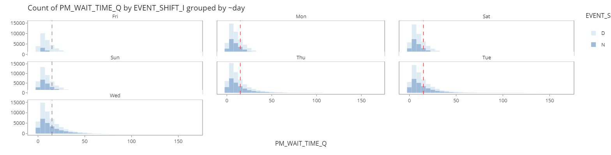

```{r setup, include=FALSE}
knitr::opts_chunk$set(echo = FALSE, warning = FALSE, message = FALSE)


```


```{css, echo = FALSE}
p{
  caption
  margin-top: 0;
  margin-bottom: 0;
  
  line-height: normal;
}

```
# Introduction

# Motivation and Objectives
* Motivated by the general lack of effective and easy to use web-enabled data visualization tool to conduct data analysis on PM operation data.
* To enable operation managers the ability to monitor,drill down and identify key attributes and continuous improvement to processes contributing to the PM productivity.

### Design Principles
* Reproducibility
* Interactivity
* Simplicity

“overview first, zoom and filter into details”, bouncing back and forth, here and there, with ease and without interrupting their train of thought. 

# Approach

* Data Wrangling
* 1. Exploratory Data Analysis(EDA)
  + Treemap
  + Bar Chart
  + Histogram   
  
* 2. Confirmatory Data Analysis(CDA)
  + Scatter Plot
  + Box-violin Plot  

* 3. Quality Control Analysis 
  + Cause and effect Diagram
  + Pareto Analysis
  + Control Chart Analysis  

* 4. Analysis and Insights


# Analysis and Insights
### 1. EDA
{width=680px}

Interactive bar chart allows changing of chart components, main, fill, & colour variable, grouping facet.

{width=680px}

Interactive histogram helps display of distributions for PM wait time and travel time.

### 2. CDA
{width=400}
Scatter plot allows for exploring correlation between PM Wait Time and Travel Time

{width=400}
Box-violin plot showcases and compares data distribution between variables


### 3. Quality Control Analysis 
* Cause and effect Diagram

Cause and effect Diagram or Ishikawa/fishbone Diagram helps managers to identify potential factors causing an overall effect of low productivity.
{width=80%}
```{R echo= FALSE, warning = FALSE}
library("SixSigma")
#Effect
effect<-"Less Productivity"

#Causes
causes.head<-c("Measurement", "Procedures/Plans", "Methods", "Environment", "Personnel", "Equipment")

#Individual Causes
causes<-vector(mode = "list", length = length(causes.head))
causes[1]<-list(c("Data error","KPI Definition" ))
causes[2]<-list(c("Roster/Schedule", "Logistic","Deployment","Compliance"))
causes[3]<-list(c("Sampling", "Analytical Procedure","Data Collection"))
causes[4]<-list(c("Traffic", "Weather","Seasonality"))
causes[5]<-list(c("Shifts","Training","Operators","Incentives"))
causes[6]<-list(c("Leakage", "Breakdown","Maintenance"))

   #   ss.ceDiag(effect,causes.head,causes,sub="",ss.col = c("","red"))

```

## Pareto Chart

Using Pareto Chart to determine and focus effort on the major contributors of PM operation time spent hence affecting the overall PM productivity.


## Control Chart

Using a variety type of control charts with control limits of 3 standard deviation, we can study the stability of the current process, analyze and make improvements, and monitor the results of the newly implemented process. The data obtained from the process can also be applied to predict future performances.


### 4. Insights


Next, we look at using histograms for insights. Terminal V48_8 has a very long tail, which means that there are many records of PMs waiting for a long time. The red reference line is set at 15 minutes, which means that there are a significant number of PMs being stuck beyond 15 minutes. The tails of the distributiosn for the other terminals are much shorter. Exploring why Terminal V48_8 is performing significantly worse than the other terminals would be a key takeaway that operation managers can explore further on.  


Considering the day of the week aspect, Tuesdays, Wednesday, and Thursday have seen significantly longer tails as compared to the other days of the week. This may be due to volume fluctuations, considering that the 3 days mentioned have greater volumes compared to the other days. Potentially, a larger volume to handle will contribute more to the waiting time. However, looking at the bar charts, only Friday sees a significant drop in volume. More has to be done to explore why the tail of the waiting time distribution extends so much during Tuesdays, Wednesdays and Thursdays.  





# Future Work 
* Implement automated check sheet to flag occurrence of long waiting or traveling time event.
  + Enable easy tracking for such events for detailed analysis 
* Take advantage of AGV implementation in new port to implement new IoT & GPS sensor data to improve data accuracy. 
  + Refresh dataset and refresh models using new equipment 
* Conduct workshops with key stakeholders to improve application and expand functionality
  + Add data upload capability
  + Introduce linear regression function with additional data from new equipment
  + Requirement sourcing with key account holders 

```{r}
knitr::write_bib(c('knitr','rmarkdown','posterdown','pagedown'), 'packages.bib')
```

# References
