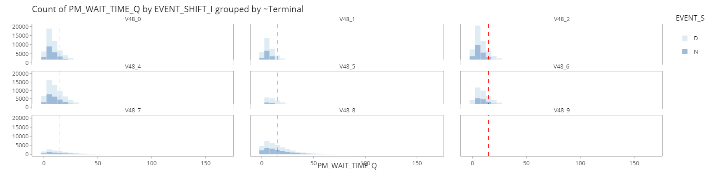
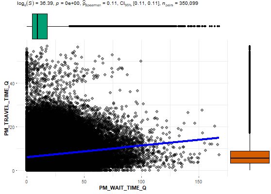
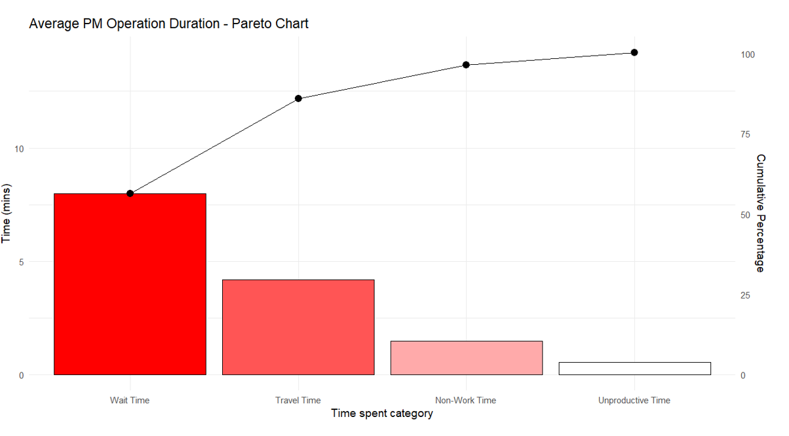
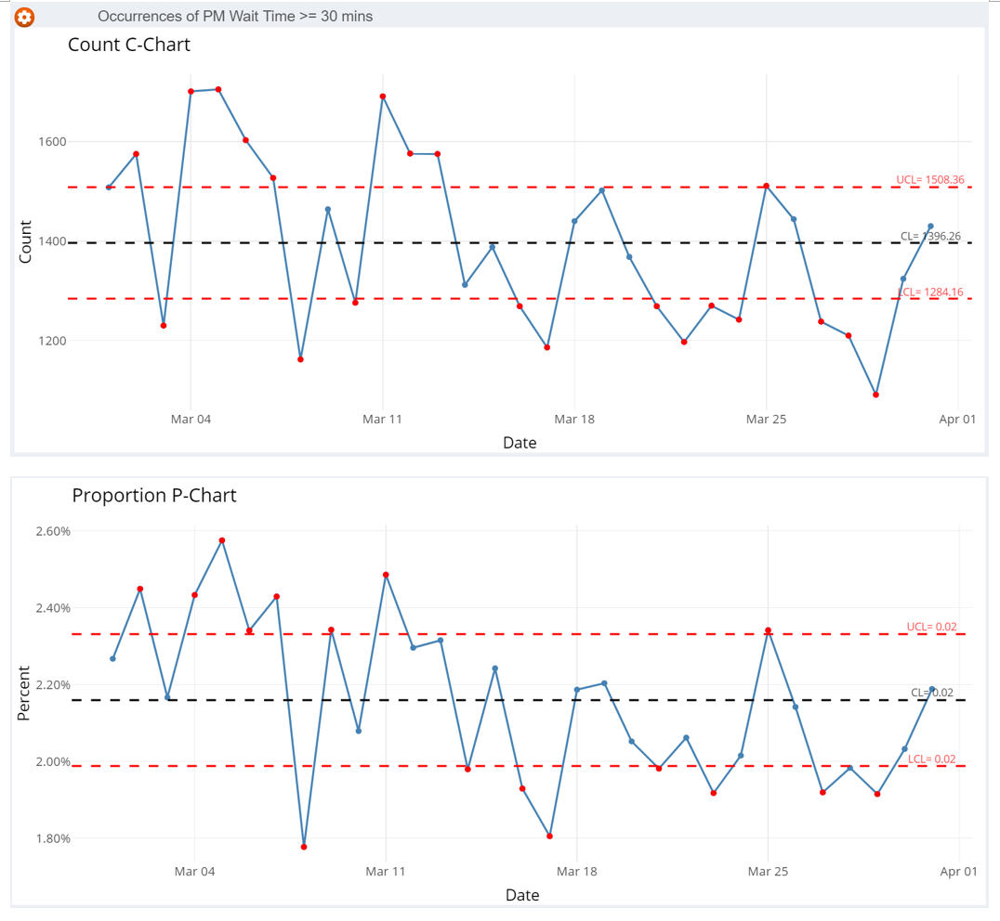

```{r setup, include=FALSE}
knitr::opts_chunk$set(echo = FALSE, warning = FALSE, message = FALSE)


```


```{css, echo = FALSE}
p{
  caption
  margin-top: 0;
  margin-bottom: 0;
  
  line-height: normal;
}

```
# Introduction

# Motivation and Objectives
* Motivated by the general lack of effective and easy to use web-enabled data visualization tool to conduct data analysis on PM operation data.
* To enable operation managers the ability to monitor,drill down and identify key attributes and continuous improvement to processes contributing to the PM productivity.

### Design Principles
* Reproducibility
* Interactivity
* Simplicity

“overview first, zoom and filter into details”, bouncing back and forth, here and there, with ease and without interrupting their train of thought. 

# Approach

* Data Wrangling
* 1. Exploratory Data Analysis(EDA)
  + Treemap
  + Bar Chart
  + Histogram   
  
* 2. Confirmatory Data Analysis(CDA)
  + Scatter Plot
  + Box-violin Plot  

* 3. Quality Control Analysis 
  + Cause and effect Diagram
  + Pareto Analysis
  + Control Chart Analysis  

* 4. Analysis and Insights


# Exploratory Data Analysis (EDA)
{width=680px}

**Interactive bar chart** allows changing of chart components, main, fill, & colour variable, grouping facet.

{width=680px}

**Interactive histogram** helps display of distributions for PM Wait time and Travel time.

# Confirmatory Data Analysis (CDA)
{width=400}

**Scatter plot** allows for exploring correlation between PM Wait Time and Travel Time

{width=400}
**Box-violin plot** showcases and compares data distribution between variables


# Quality Control Analysis 

<center>
{width=50%}
</center>
**Cause and effect Diagram**
AKA Ishikawa/fishbone Diagram helps operation managers to identify potential factors/causes to the overall effect of low productivity visually and logically.

{width=100%}

**Pareto and Control charts** are used together to help tunnel down into the operation process and to find the root cause of productivity problems. The Pareto chart helps to identify and focus effort on the top portion of the causes to resolve the key contributors of the problem.


{width=50%}{width=50%}
Using a variety type of control charts with control limits of 3 standard deviation, we can study the stability of the current process, analyze and make improvements, and monitor the results of the newly implemented process. The data obtained from the process can also be applied to predict future performances.


# Future Work 
* Implement check sheet to record actual causes when long waiting or traveling time event as input for process improvement. 
* Extend Visual Analytic technique to future terminals' Automate guided Vehicle(AGV) with inbuilt with IoT & GPS sensors to improve data accuracy, processes and productivity. 
* Conduct workshops with key stakeholders to improve application and expand functionality
  + Add data upload capability
  + Introduce linear regression function with additional data from new equipment

```{r}
knitr::write_bib(c('knitr','rmarkdown','posterdown','pagedown'), 'packages.bib')
```


