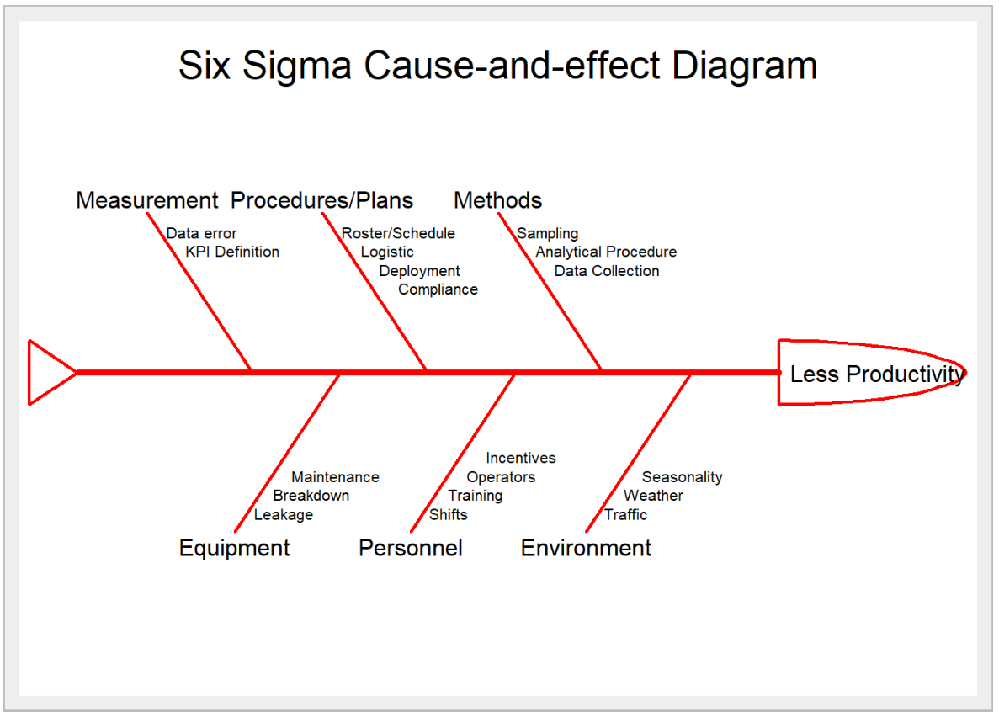

```{r setup, include=FALSE}
knitr::opts_chunk$set(echo = FALSE)
```

# Introduction

# Motivation and Objectives

* Motivated by the general lack of effective and easy to use web-enabled data visualization tool to conduct data analysis on PM operation data.

* To enable operation managers the ability to monitor,drill down and identify key attributes and continuous improvement to processes contributing to the PM productivity.

### Design Principles

* Reproducibility
* Interactivity
* Simplicity

“overview first, zoom and filter into details”, bouncing back and forth, here and there, with ease and without interrupting their train of thought. 

# Approach

* Datawrangling
* 1. Exploratory Data Analysis(EDA)
* 2. Confirmatory Data Analysis(CDA)
* 3. Quality Control Analysis 
  + Cause and effect Diagram
  + Pareto Analysis
  + Control Chart Analysis

* 4. Analysis and Insights


# Analysis and Insights
Results - Screenshots and a working demo of the system you built.

### 1. EDA

### 2. CDA

### 3. Quality Control Analysis 
* Cause and effect Diagram

Cause and effect Diagram or Ishikawa/fishbone Diagram helps managers to identify potential factors causing an overall effect of low productivity.
{width=80%}
```{R echo= FALSE}
library("SixSigma")
#Effect
effect<-"Less Productivity"

#Causes
causes.head<-c("Measurement", "Procedures/Plans", "Methods", "Environment", "Personnel", "Equipment")

#Individual Causes
causes<-vector(mode = "list", length = length(causes.head))
causes[1]<-list(c("Data error","KPI Definition" ))
causes[2]<-list(c("Roster/Schedule", "Logistic","Deployment","Compliance"))
causes[3]<-list(c("Sampling", "Analytical Procedure","Data Collection"))
causes[4]<-list(c("Traffic", "Weather","Seasonality"))
causes[5]<-list(c("Shifts","Training","Operators","Incentives"))
causes[6]<-list(c("Leakage", "Breakdown","Maintenance"))

   #   ss.ceDiag(effect,causes.head,causes,sub="",ss.col = c("","red"))

```

## Pareto Chart

Using Pareto Chart to determine and focus effort on the major contributors of PM operation time spent hence affecting the overall PM productivity.


## Control Chart

Using a variety type of control charts with control limits of 3 standard deviation, we can study the stability of the current process, analyze and make improvements, and monitor the results of the newly implemented process. Furthermore, the data obtained from the process can also be applied to predict future performances of the process. 


### 4. Insights


# Future Work 
An explanation of how the work could be extended.

```{r}
knitr::write_bib(c('knitr','rmarkdown','posterdown','pagedown'), 'packages.bib')
```

# References
