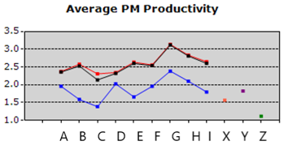
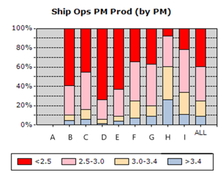
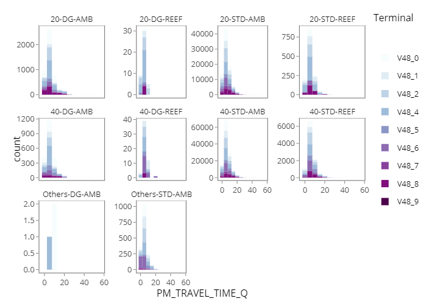
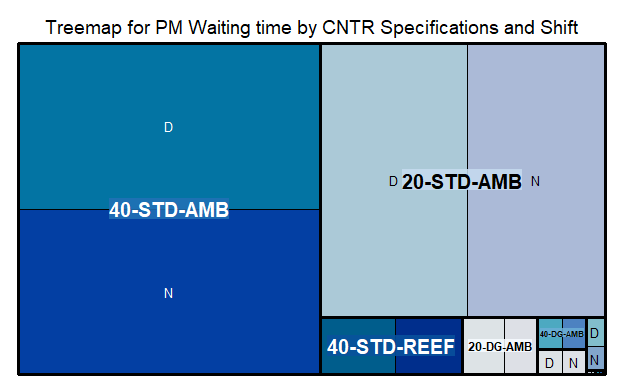
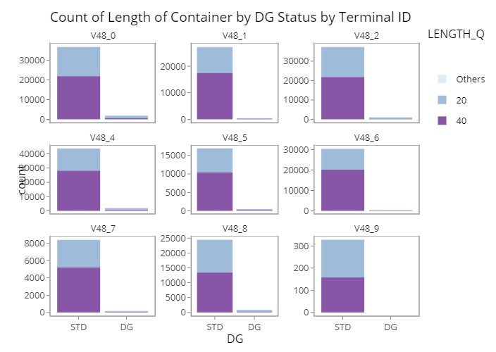
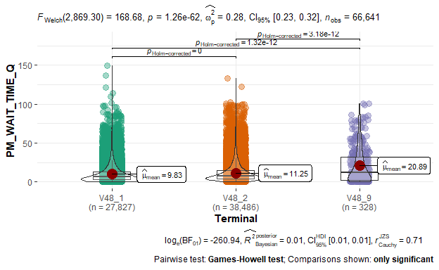
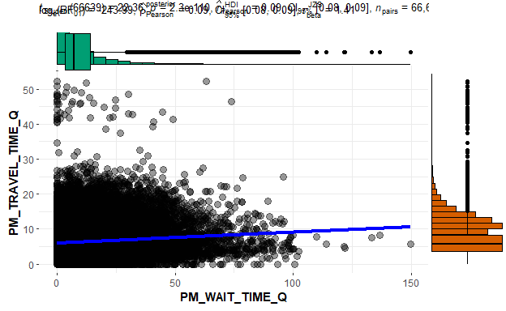
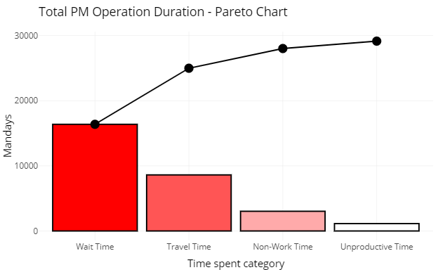
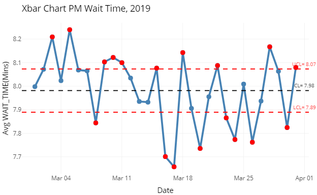

```{r setup, include=FALSE}
knitr::opts_chunk$set(echo = FALSE)
```


## Introduction 


Maritime trade has been the backbone of international trade as they account for approximately 92% of world trade.^1^ PSA Singapore handles about a fifth of the world’s transhipped containers as the world’s busiest transhipment port.^2^ For more than four decades, PSA continuously developed and upgraded its container handling infrastructure, pioneered new systems and processes, and streamlined operations to meet the rapid growth in its container terminal business as part of the strive for operational excellence.^3^ 

Upon a vessel’s arrival at a berth in the container terminal, containers are discharged from and loaded onto it. A typical discharging operation starts with a quay crane picking up a container from the vessel and placing it onto a PM, which will then transport to a storage yard. At the yard, a yard crane picks up the container from the PM and shifts it to a designated spot. Loading operations involve the transporting of containers in the opposite direction, from the yard to the vessel.^4^

Therefore, PM productivity is of key interest to PSA as it is the main driver for the time taken to load and unload vessels. PM Productivity is defined as the sum of the total number of containers handled divided by the total hours. The following are the key terms which PSA uses to define PM productivity.  

$$ Productivity = Total Containers Handled / Total Time $$
$$Total Time = Sum (Est. Travel Time + Est. Wait Time + Non Work Time)$$

*Total Time* is defined as the time difference between the two operation activities.  

*Estimated Travel Time* is the duration between two locations based on distance matrix with fixed speed limit/hr. 

*Non-Work Time* is the time taken for a change of driver, meal break, and PM breakdown (if any). 

*Estimated Wait Time* = Total Time – Non-Work Time – Est. Travel Time 

## Project Motivation

The study objective is to seek insight from Prime Mover (PM) Operations records to identify common characteristics exhibited by PM with high and low waiting times, through understanding of PM events and operational data. This, in turn, enables us to pinpoint and identify correlated attributes and embark on further study to improve the overall productivity of PM operations and resource utilisation through active targeting of activities contributing to the PM waiting time.  


## Review of Existing Work

Current operation performances are tracked using Operation Indicators such as PM productivity and PM waiting time aggregated by duration, from shifts to monthly reports and breakdown by individual terminal and PM. Some examples of current visualisations are shown below. These were designed many years ago and have not been updated. They are high level aggregations and do not offer significant avenues for insight generation.  

{ width=500px}
{ width=500px}

Previous studies on PM operation efficiency typically focus on crane productivity by work schedule^5^ , and resource planning & deployment to find the optimal number of PMs and trucks (haulier) to reduce average PM waiting time.^6^ 


## Proposed Scope and Methodology
This study seeks to create an R Shiny app that allows for users to input parameters to suit their needs.

1. Interactive dashboard that allows for Operations Managers to understand
     a) Summary statistics for PM events 
     
          i. Histograms for wait time with parameters for each type of container
          
          { width=500px}
          
         ii. Time series for wait times with variable parameters
         iii. Tree maps for container types and movements 
         
         { width=500px}
         
         iv. Bar charts of container types 


     b) Performance of Terminals 
     i. Bar chart for terminal ID      
     
     { width=500px}

      c) Performance of type of containers (Dangerous Goods, Reefer, General Purpose) & size of containers (20-footer, 40-footer, Oversized)  
      


2.	Confirmatory data analysis          
     a) Uncertainty analysis through calculation of median and confidence intervals of time spent based on types and sizes of containers, different terminals, Equipment type, Day/night shifts, different yard activities.
     
     b) Distribution comparisons between categories of containers(e.g. using box plots, violin plots)
     
     { width=500px}
     
     c) Scatter plots for correlation analysis
     
     { width=500px}

3.	Quality Control           
     a) Pareto Chart
      {width=700px}

     b) COntrol Chart as time series and visualising mean / upper & lower bounds
     { width=500px}
     

 
## Storyboard and Visualisation Features

The Shiny app will be designed in this manner:

**Introduction**: To give context and background for the project

**EDA - Treemaps**: To visualise the proportion of different types of parameters (container type, equipment type)

**EDA - Bar Charts**: To visualise the counts and activities happening in a day

**EDA - Histogram**: To visualise the distribution of waiting times and driving times of the activities

**CDA - Violin / Box Plots**: To visualise the confidence intervals and distribution

**CDA - Scatter Plots **: To visualise the correlation levels

**Quality Control - Pareto Chart**: To identify the key contributors to waiting time

**Quality Control - Control Chart**: To visualise a time series and the dataset's mean, upper and lower limits of distribution. 

**About**: To provide definitions and FAQs 

## Data Source
The data source used is provided by PSA Singapore’s PM OPS anonymised dataset that contains PM operation event records in a generic month. There are approximately 5 million records with 69 variables. The dataset is reduced to the following 19 variables for the analysis:


|     S/N    |     Variable   Name                |     Description                                                                                                                                                                                                                                      |
|:------------:|------------------------------------|------------------------------------------------------------------------------------------------------------------------------------------------------------------------------------------------------------------------------------------------------|
|     1      |     [SHIFT_D]                      |     Date   of shift                                                                                                                                                                                                                                  |
|     2      |     [TERMINAL_ID]                  |     Container   Terminal ID                                                                             
|     3      |     [EVENT_C]                      |         **EQOF** = Equipment Offload from PM to Yard Crane    **EQMT** = Equipment Mount to PM from Yard Crane      |
|     4      |     [EVENT_DT]                     |     Event   Datetime                                                                                                                                                                                                                                 |
|     5     |     [EVENT_SHIFT_I]                |     Shift   indicator     **D** =Day    **N** = Night                                                                                                                                                                                                |
|     6     |     [MOVE_OP_C]                    |     Move   Operation Code                                                                                                                                                                                     |
|     7     |     [LENGTH_Q]                     |     Container   Length e.g 20 40 45 ft                                                                                                                                                                                                            |
|     8     |     [CNTR_TYPE_C]                  |     Container   Type     **RF** = Reefer    **GP** = General Purpose   **DG** = Dangerous Goods    **OH** = Over height Container    **UC** = UnContainerized                                                                                                           |
                                                                                                                                             |
|     9     |     [CNTR_ST_C]                    |     Container   Status **E** = Empty , **F** = Full                                                                                                                                                                                                  |
|     10     |     [DG_I]                         |     Dangerous   Good Indicator                                                                                                                                                                                                                       |
|     11     |     [REEFER_I]                     |     Reefer   Indicator                                                                                                                                                                                                                               |
|     12     |     [UC_I]                         |     Uncontainerized   Indicator                                                                                                                                                                                                                      |
|     13     |     [OVER_SIZE_I]                  |     Over   Size Container Indicator                                                                                                                                                                                                                  |
                                                                                                                                             |
|     14     |     [EQUIPMENT_TYPE_C]             |     Equipment   Type Code (Quay Crane and Type of Yard Cranes)                                                                                                                                                                                       |
|     15     |     [PM_DISTANCE_Q]                |     Distance   travelled from previous location                                                                                                                                                                                                      |
|     16     |     [PM_TRAVEL_TIME_Q]             |     Travel   Time                                                                                                                                                                                                                                    |
|     17     |     [PM_WAIT_TIME_Q]               |     Wait   Time                                                               |                          
|     18     |     [hour]               |     Hour of day |
|     19     |     [day]               |     Day of the Week 


## Application Libraries & Packages
-	R Shiny
-	ggplot
-	tidyverse
-	RMarkdown
-	dplyr
- ggstatsplot
- infer
- d3treeR
- lubridate
- qicharts2
- ggQC 
- qcc
- gridExtra 
- shinyBS
- SixSigma
- forcats

## Task Breakdown
The areas of responsibility are foreseen to be as follows.

| Tasks                                                                                                                                             | Team Members Responsible |
|---------------------------------------------------------------------------------------------------------------------------------------------------|:--------------------------:|
| Introduction and business problem definition                                                                                                      | KC                       |
| Data acquisition and preparation - cleaning & anonymisation                                                                                       | Both                       |
| Literature Review                                                                                                                                 | Both                       |
| Exploratory Data Analysis - Treemaps (container types & terminals) - Pie / Bar charts (activity counts) - Histograms (waiting time, driving time) | KC                       |
| Confirmatory Data Analysis  - Scatter plots to visualise correlations                                                        | KC       |
| Confirmatory Data Analysis - Median, confidence intervals via box plots / violin plots for waiting times - Error bars  | KC                       |
| Quality Control - Pareto Analysis | ZL |
| Quality Control - Control Charts | ZL|
| Insights and recommendations for actions                                                                                                          | KC|
| Limitations and conclusion                                                                                                                        | ZL        


## Github Repository

The repository will be uploaded here. [Link](https://github.com/kaichin29/Project/tree/master/Project)
## References

 ^1^ https://royalsocietypublishing.org/doi/10.1098/rsos.200386 
 
^2^  https://seanews.co.uk/features/the-busiest-ports-in-the-world-and-how-they-handle-operations-part-ii-singapore/

^3^  https://www.globalpsa.com/psa-international/

^4^  https://www.scs.org.sg/articles/how-arti-cial-intelligence-can-make-our-port-smarter 

^5^  https://www.pomsmeetings.org/confpapers/005/005-0094.doc

^6^  https://www.win.tue.nl/oowi/final%20project/archive/KoenStaats.pdf


